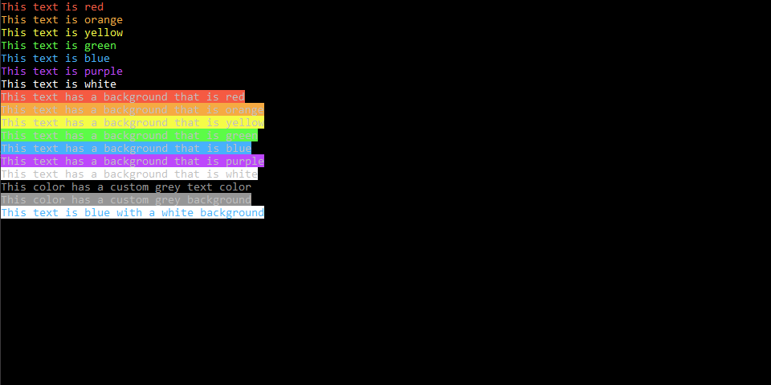

# ColorIt
A simple library to add color to your output.

Have you ever wanted to print colors to the console? I certainly have. There comes a time when you realize it is a necessity. That's why I created ColorIt. ColorIt is a super simple way to print color to the console. 

## How it works

Interally, the library creates custom ANSI sequences with RGB values. This means there will never be a problem where a color changes. For example if I were to use pre-defined ANSI sequence, `\033[34m`, it would not print blue as it previously did. But, this problem is avoided because it doesn't use predefined values, each one is custom made.

## Installation
There are two ways to install ColorIt, if you are creating something that is not for personal use, use the first method. Otherwise, use the second. This is because if you send out the code and ColorIt is not in the project directory, a different user will get an error saying that the file was not found.

* Install the file into each of you project's directories. **This method doesn't allow repeated use, you have to do it for each project.**

* Install the `colorit.py` file into your `<Directory to python>\Python\<python version folder>\Lib\site-packages` path. **This method allows repeated use, you only have to do it once.**

## How to use it

To use ColorIt:

```python
from colorit import *

# Use this to ensure that ColorIt will be usable by certain command line interfaces
init_colorit()

# Foreground
print(color("This text is red", colors.RED))
print(color("This text is orange", colors.ORANGE))
print(color("This text is yellow", colors.YELLOW))
print(color("This text is green", colors.GREEN))
print(color("This text is blue", colors.BLUE))
print(color("This text is purple", colors.PURPLE))
print(color("This text is white", colors.WHITE))

# Background
print(background("This text has a background that is red", colors.RED))
print(background("This text has a background that is orange", colors.ORANGE))
print(background("This text has a background that is yellow", colors.YELLOW))
print(background("This text has a background that is green", colors.GREEN))
print(background("This text has a background that is blue", colors.BLUE))
print(background("This text has a background that is purple", colors.PURPLE))
print(background("This text has a background that is white", colors.WHITE))

# Custom
print(color("This color has a custom grey text color", (150, 150, 150)))
print(background("This color has a custom grey background", (150, 150, 150)))

# Combination
print(
    background(
        color("This text is blue with a white background", colors.BLUE), colors.WHITE
    )
)

# If you are using Windows Command Line, this is so that it doesn't close immediately
input()
```

As output you get:



If you would like to try this for yoyr self, you can download `demo.py` and try it out. 

And that's it. That's really all there is to it.

## Release Log
* Released the first version of ColorIt (v1.0.0)
* Added a license

## Support me on patreon!
Here is the link to my patreon page: https://www.patreon.com/supermazingcoder :D
